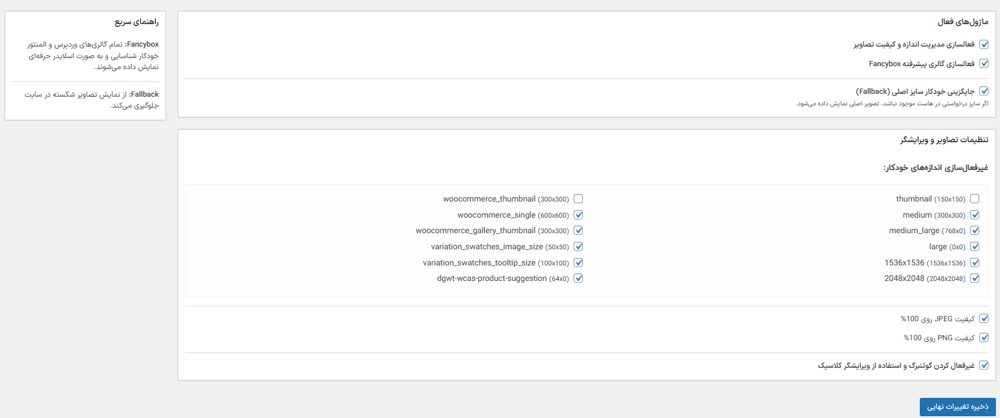

# Smart Media Manager 🚀

Smart Media Manager یک افزونه سبک، هوشمند و همه‌کاره برای وردپرس است که با هدف بهینه‌سازی مدیریت رسانه و ارتقای تجربه بصری کاربران طراحی شده است. این افزونه ترکیبی از مدیریت ابعاد تصاویر، بهبود کیفیت و یک گالری لایت‌باکس حرفه‌ای (Fancybox) است.

## ✨ قابلیت‌های کلیدی

 مدیریت هوشمند ابعاد (ISQM) جلوگیری از ساخته شدن سایزهای اضافی تصاویر برای صرفه‌جویی در فضای هاست.
 کنترل کیفیت تصاویر امکان تنظیم کیفیت تصاویر JPEG و PNG روی ۱۰۰٪ جهت حفظ حداکثر جزئیات.
 گالری پیشرفته Fancybox فعال‌سازی لایت‌باکس مدرن روی گالری‌های وردپرس و المنتور.
 سیستم جایگزینی هوشمند (Fallback) نمایش خودکار نسخه اصلی تصویر در صورت موجود نبودن سایزهای کوچک‌تر.
 مدیریت ویرایشگر سوئیچ آسان بین گوتنبرگ و ویرایشگر کلاسیک.

### 📸 پیش‌نمایش محیط گالری

---

## 📖 آموزش استفاده از کد (برای توسعه‌دهندگان)

این افزونه به گونه‌ای طراحی شده که کمترین تداخل را با قالب‌ها داشته باشد. برخی نکات فنی

### ۱. سفارشی‌سازی Fancybox
تنظیمات Fancybox در انتهای فایل اصلی و در بخش `setupFancybox` قرار دارد. شما می‌توانید با تغییر پارامترهای شیء `Fancybox.bind` مواردی مثل سرعت انیمیشن، وضعیت چرخش تصاویر و... را تغییر دهید.

### ۲. فیلترهای کیفیت
افزونه از هوک‌های استاندارد وردپرس استفاده می‌کند
- `jpeg_quality` برای کنترل فشرده‌سازی تصاویر JPG.
- `wp_editor_set_quality` برای کنترل کیفیت تصاویر خروجی ویرایشگر.

### ۳. توسعه Fallback
تابع مربوط به `image_downsize` طوری شرط‌بندی شده که فقط در سمت کاربری (Front-end) عمل کند تا خللی در ویرایشگر تصویر شاخص در پنل مدیریت ایجاد نشود.

---

## 🤝 راهنمای مشارکت (Contribution)

از مشارکت شما برای بهبود این پروژه استقبال می‌شود! برای مشارکت

۱. ابتدا پروژه را Fork کنید.
۲. یک شاخه (Branch) جدید برای ویژگی یا رفع باگ خود بسازید
   `git checkout -b featureAmazingFeature`
۳. تغییرات خود را Commit کنید
   `git commit -m 'Add some AmazingFeature'`
۴. به شاخه اصلی Push کنید
   `git push origin featureAmazingFeature`
۵. یک Pull Request باز کنید.

---

## 🛠 نصب و راه‌اندازی

۱. پوشه افزونه را در مسیر `wp-contentplugins` آپلود کنید.
۲. افزونه را از بخش «افزونه‌ها» در پیشخوان فعال کنید.
۳. به مسیر رسانه  Smart Media Manager بروید.

## 💻 توسعه‌دهنده
طراحی و توسعه توسط امین ارجمند
- [وب‌سایت شخصی](httpsaminarjmand.com)

## 📄 لایسنس
این پروژه تحت لایسنس MIT منتشر شده است.